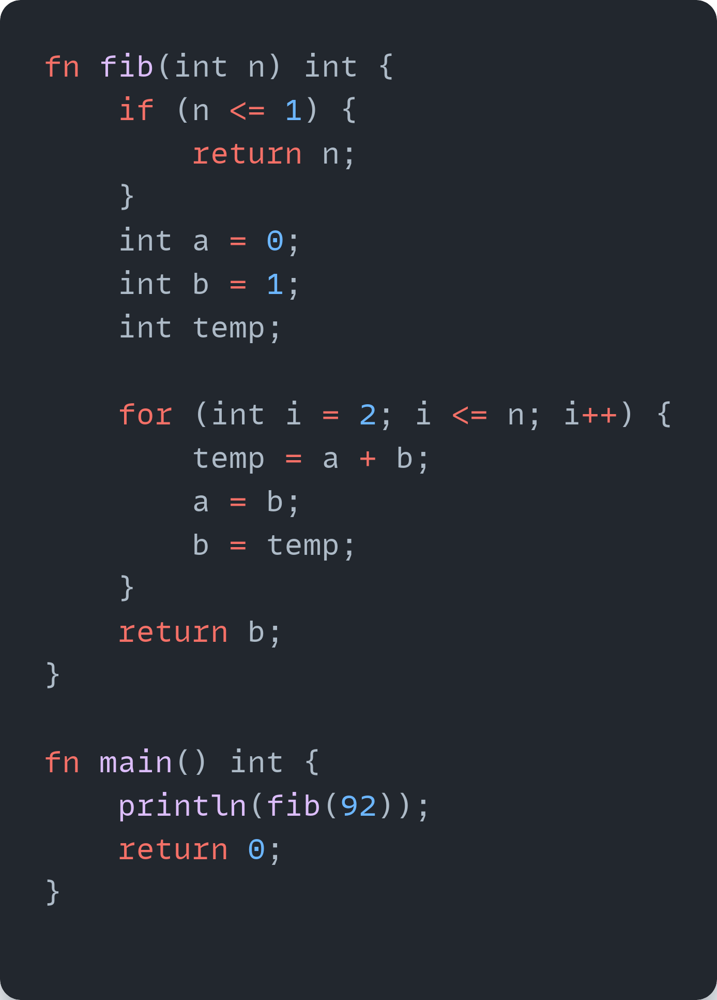
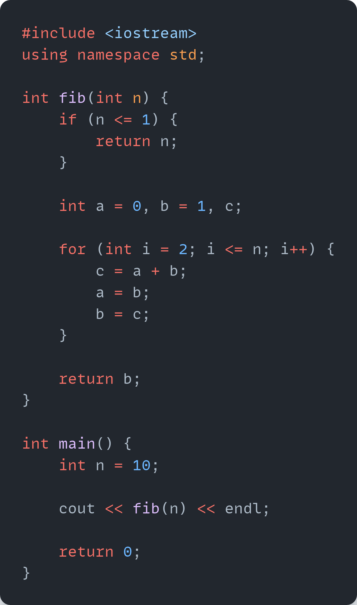

# Obsidian Language: **An Experimental Language**

<p align="right">
  <a href="#why-build-obsidian">Why?</a> |
  <a href="#language-goals">Goals</a> |
  <a href="#project-status">Status</a> |
  <a href="#getting-started">Getting Started</a> |
  <a href="#join-us">Join Us</a>
</p>

<a href="docs/snippets.md#fib">

</a>

### **Why Obsidian?**

- **Fast**:  
  - Performance comparable to C++ using LLVM, with direct access to low-level constructs.
  - Efficient and scalable builds.

- **Modern & Evolving**:  
  - Intuitive for developers familiar with C++, with easy-to-learn language foundations.
  - Smooth upgrade path between versions.
  - Emphasis on safety and a roadmap towards memory safety.

- **Welcoming Open-source Community**:  
  - Transparent goals and decision-making.
  - An inclusive, friendly, and open community.
  - Comprehensive toolset: compiler, libraries, documentation, package manager, and more.

## Why Build Obsidian?

C++ has long been the standard for high-performance applications, but its extensive history has introduced significant technical debt, complicating further advancements. We believe that creating a new language from the ground up—free from the legacy constraints of C/C++—is the optimal solution to these issues. Obsidian is designed to provide a language with a clean syntax, modular architecture, and contemporary features, facilitating a smoother transition from C++ without compromising on performance.

Obsidian is not intended to replace modern languages like Go, Swift, or Rust; rather, it is tailored for scenarios where moving away from C++ is impractical due to design or performance constraints.

## Language Goals

- High performance for critical applications.
- Code that's easy to read, write, and maintain.
- Safe coding patterns with built-in testing mechanisms.
- Support for modern OS platforms, architectures, and environments.
- Fast iteration and development cycles.

While these goals overlap with other languages, Obsidian's unique value lies in their combination.

### Non-goals:

- Stable [application binary interface (ABI)](https://en.wikipedia.org/wiki/Application_binary_interface).
- Absolute backward or forward compatibility.

For more details, see our [goals document](/docs/project/goals.md).

## Project Status

Obsidian is in the experimental phase, with active development on the toolchain, including a compiler and linker. Our focus is on creating a viable language for evaluation as a C++ successor. Key developments include:

- A robust strategy and structure for the Obsidian project.
- An open-source governance model and evolution process.
- Core language design informed by C++ experiences, covering:
  - Generics, class types, and inheritance.
  - Operator overloading.
  - Syntax and modular design.
- An early-stage compiler for converting Obsidian code into executables.

Check out our [full roadmap](/docs/project/roadmap.md) for more details.

## Obsidian vs. C++

<p align="center">
  <a href="docs/snippets.md#c" style="display: inline-block; margin-right: 10px;">
    
  </a>
  <a href="docs/snippets.md#obsidian" style="display: inline-block; margin-left: 10px;">
    
  </a>
</p>

## Generics

Obsidian features a **[modern generics system](/docs/design/generics/overview.md#what-are-generics)** with type-checked definitions:

- **Type-checked generics**: Catch errors early, without needing instantiation.
- **Automatic type erasure**: Supports dynamic dispatch without separate implementations, reducing binary size.
- **Clear interfaces**: Reduce accidental dependencies and ensure clearer contracts.

Obsidian's generics system also allows **specialization** for performance-critical cases, offering similar flexibility to C++ templates. Learn more about [Obsidian's generics](/docs/design/generics).

## Memory Safety

Memory safety is a priority, focusing on:

- Improved tracking and enforcement of initialization.
- Dynamic bounds checks for secure debug builds.
- Robust API designs to support safer programming patterns.

## Getting Started

Obsidian is in early development, with nightly releases of the toolchain available.

```shell
# Get the release
wget https://github.com/obsidian-language/obsidian/releases/download/v${VERSION}/obsidian-${OS}-${ARCH}.tar.gz

# Unpack the toolchain:
tar -xvf obsidian-${OS}-${ARCH}.tar.gz

# Create a simple Obsidian source file:
echo "fn main() int { println(42); return 0; }" > forty_two.ob

# Compile to an executable file:
./obsidian forty_two.ob -o forty_two

# Run it:
./forty_two
```

Note: This is a very early-stage release, and many features are still in development. Check out our [0.1 milestone](/docs/project/milestones.md) for upcoming improvements.

### Building & Installing

For full infomation on building Obsidian, see [Obsidian Building Guide](#). Here follows a summary - if you get into trouble, the Building Guide has all the answers.

Before builing Obsidian you may need to install some other tools and libraries. See, [Setting up your system for builing Obsidian](#).

**Quick start**: Obsidian is built using the [Make build system](#). The following gives you a default build:
```
$ ./boot
$ ./configure
$ make
```

The `./boot` step is only necessary if this is a tree checked out from git.

## Join Us

We'd love to have folks join us and contribute to the project. Obsidian is committed to a welcoming and inclusive environment where everyone can contribute.

- Most of Obsidian's design discussions occur on [Discord](https://discord.gg/#).
- To watch for major release announcements, subscribe to our [Obsidian release post on GitHub](#) and [star Obsidian-lang](https://github.com/obsidian-language/obsidian).
- See our [code of conduct](CODE_OF_CONDUCT.md) and [contributing guidelines](CONTRIBUTING.md) for information about the Obsidian development community.

### Contributing

You can also directly:

- [Contribute to the language design](CONTRIBUTING.md#contributing-to-the-language-design): feedback on design, new design proposals.
- [Contribute to the language implementation](CONTRIBUTING.md#contributing-to-the-language-implementation): [Obsidian Toolchain](/lib/), and project infrastructure.

You can **check out some ["good first issues"](https://github.com/obsidian-language/obsidian/labels/good%20first%20issue)**, or join the `#contributing-help` channel on [Discord](https://discord.gg/#). See our full [`CONTRIBUTING`](CONTRIBUTING.md) documentation for more details.
